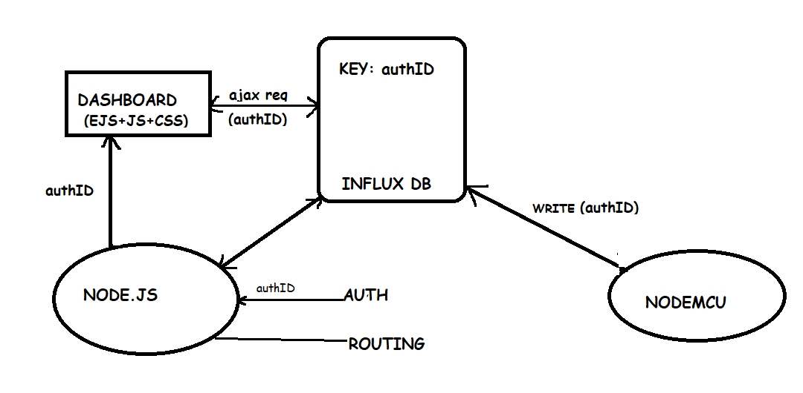
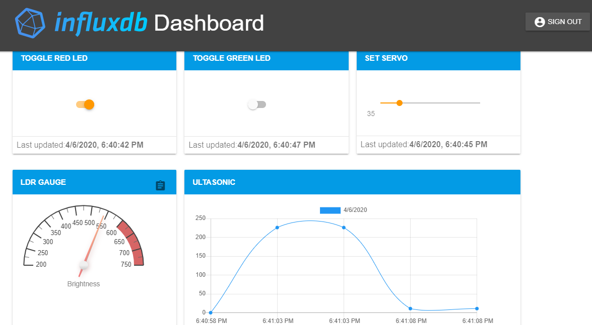
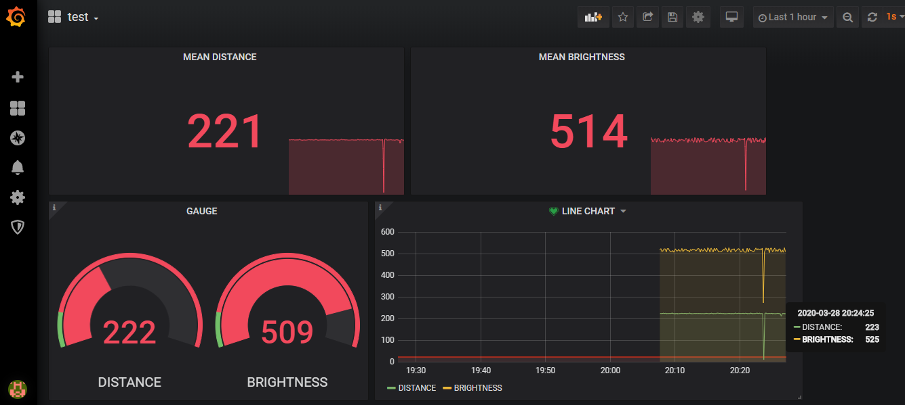
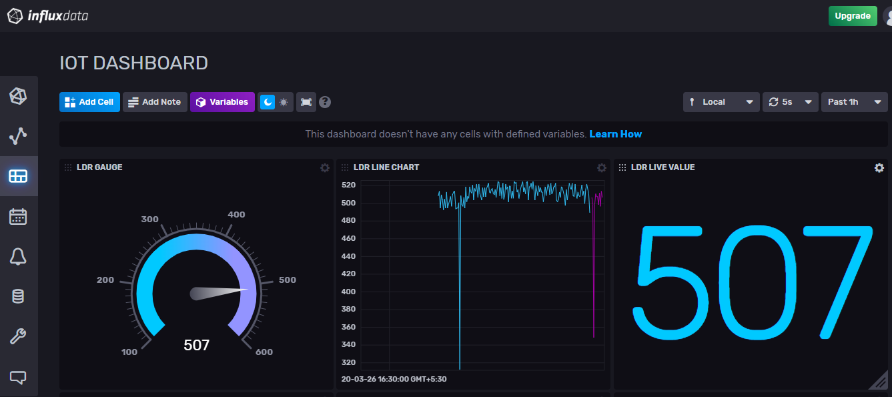

# IoT Session on Grafana, InfluxDB, MQTT, Node.JS

## WORKING with INFLUXDB HTTP API

## WORKING with INFLUXDB AND MQTT

## DATA VISUALISATION ON NODE.JS

## DATA VISUALISATION ON GRAFANA

## DATA VISUALISATION ON INFLUXDB CLOUD v2

## LINK FOR WRITTEN BLOG
